### Anotações gerais, documentação e insights sobre o bootcamp MultiCloud, DevOps e AI Challenge.

&nbsp;

# Dia 01 - Automatizando o provisionamento AWS com Terraform usando Claude

&nbsp;

> **💡Inteligência artificial, multicloud & DevOps juntos estão moldando o futuro do mercado de TI, criando a base para uma nova era de inovação e automação.**

&nbsp;

**Cronograma do desafio de 5 dias:**

**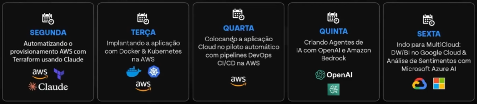**

&nbsp;

**Projeto que será usado nas próximas aulas práticas:**

Integrará ferramentas DevOps, múltiplas clouds dois assistentes de IA:

**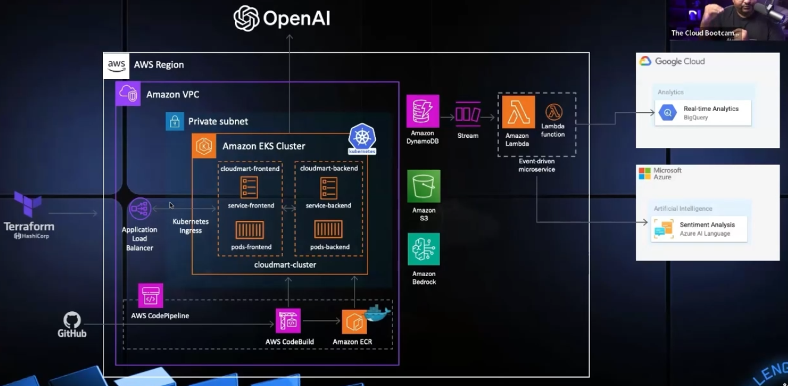**

&nbsp;

**📝** **IAM:** Método de <ins>autenticação</ins> para facilitar a autenticação das máquinas virtuais, através de roles  
**📝 EC2:** Amazon Elastic Compute Cloud (EC2) é um serviço da Amazon que permite criar e executar aplicações na nuvem. Ele oferece capacidade computacional escalável e redimensionável  
**📝 S3:** O S3 é uma solução de armazenamento de objetos que permite armazenar e recuperar dados de qualquer lugar do mundo.

&nbsp;

**AULA PRÁTICA**

Código Terraform para criar um bucket S3 na AWS com um nome único na região us-east-1:

```Terraform
provider "aws" {
  region = "us-east-1"  # Substitua pela região desejada
}

resource "random_id" "bucket_suffix" {
  byte_length = 8
}

resource "aws_s3_bucket" "my_bucket" {
  bucket = "my-unique-bucket-name-${random_id.bucket_suffix.hex}"

  tags = {
    Name        = "My bucket"
    Environment = "Dev"
  }
}
```

&nbsp;

Inicializar o Terraform  
`terraform init`

Planejar o que será criado  
`terraform plan`

Provisionar os recursos  
`terraform apply`  
<br/>Listar os buckets criados via CLI  
`aws s3 ls`

Excluir os recursos criados  
`terraform destroy`

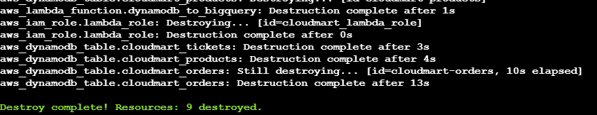

&nbsp;

# Dia 02 - Implantando a aplicação com Docker & Kubernetes na AWS

&nbsp;

> **💡Visão estratégica:** Mesmo que eu já esteja em uma posição confortável no mercado de trabalho, é importante sempre estar atualizado das novas tecnologias e tendências atuais.

&nbsp;

**📝 Docker** é uma tecnologia que permite empresas empacotar, entregar e executar aplicações e suas dependências (bibliotecas) de forma padronizada.

**Estrutura de uma aplicação containerizada**

- Máquina virtual
- Sistema operacional
- Containers com as aplicações, bibliotecas e dependências

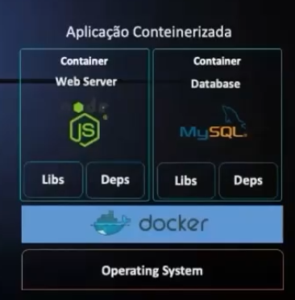

&nbsp;

**Docker: casos de uso**

**Modernização das aplicações "tradicionais" para Microsserviços**  
 - Se um container falhar, apenas uma parte da aplicação ficará indisponível.  
 - Novas implementações sem afetar outros componentes/serviços.

**Padronização dos deployments**  
 - As imagens docker construídas através de arquivos de definição.

**Ambientes semelhantes**  
 - Docker roda em qualquer lugar  
 - Basta ter o docker instalado

&nbsp;

**📝 Kubernetes:** Sistema de <ins>orquestração</ins> de containers mais popular, criado pela Google para gerir seus aplicativos internos:

- Estrutura organizada em forma de objetos ou componentes do K8S.
- Implementação baseada em um simples arquivo de texto (.yaml).
- Solução open source e suportada por múltiplos servidores de cloud (multicloud).

&nbsp;

**🎯 Como o Docker vai me ajudar na minha carreira?**

- Aprender Docker é o primeiro passo para avançar para o próximo nível: Kubernetes
- Aplicações modernas fazem uso de arquitetura de microsserviços
- Existem outros container runtime, mas Docker é o mais popular.
- Terraform é a evolução da infra; Docker é a evolução das aplicações.

&nbsp;

**🎯 Como o Kubernetes vai me ajudar na minha carreira?**

- Kubernetes está presente desde pequenas startups a grandes empresas.
- Kubernetes é o presente e futuro de aplicações modernas rodando em multicloud
- Sobre orquestradores de containers, Kubernetes é sem dúvidas o mais popular
- Kubernetes é fundamental para empresas que executam aplicações na nuvem.

&nbsp;

Como uma **VM** funciona?

Cada VM Possui: App, SO, Kernel, Libs e Deps

- Alta utilização de recursos (OS/Kernel);
- Alto consumo de disco (GB);
- Inicialização: minutos

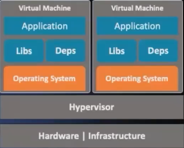

&nbsp;

Como o **Docker** funciona?

Cada **container** possui: App, Libs e Deps;

- Baixa utilização de recursos (apenas uma pequena parte do Kernel);
- Baixo consumo de disco (MB);
- Inicialização: segundos.

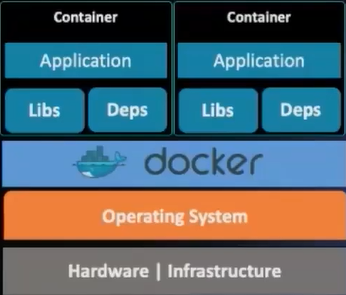

&nbsp;

**Como o Kubernetes funciona?**

O Kubernetes gerencia automaticamente os contêineres dentro de um cluster de servidores.  
<br/>O nó <ins>Master</ins> gerencia o cluster, enquanto os nós <ins>Workers</ins> executam as aplicações. Se um nó falhar, a aplicação continua funcionando porque o Kubernetes redistribui automaticamente os contêineres para outros nós disponíveis. O Kubernetes precisa estar instalado em todos os nós para que funcione corretamente.

&nbsp;

📝 **DynamoDB** é o serviço de banco de dados da AWS. Vamos criar as tabelas do banco usando **Terraform**. Hoje, vamos aprender como rodar a aplicação localmente, <ins>antes</ins> de aprofundarmos com o Kubernetes.

&nbsp;

**AULA PRÁTICA**

**Criar as tabelas do CloudMart usando Terraform**

```Terraform
provider "aws" {
  region = "us-east-1"  # Altere para sua região preferida
}

# Tabelas DynamoDB
resource "aws_dynamodb_table" "cloudmart_products" {
  name           = "cloudmart-products"
  billing_mode   = "PAY_PER_REQUEST"
  hash_key       = "id"

  attribute {
    name = "id"
    type = "S"
  }
}

resource "aws_dynamodb_table" "cloudmart_orders" {
  name           = "cloudmart-orders"
  billing_mode   = "PAY_PER_REQUEST"
  hash_key       = "id"

  attribute {
    name = "id"
    type = "S"
  }
}

resource "aws_dynamodb_table" "cloudmart_tickets" {
  name           = "cloudmart-tickets"
  billing_mode   = "PAY_PER_REQUEST"
  hash_key       = "id"

  attribute {
    name = "id"
    type = "S"
  }
}
```

O código acima criará **3 tabelas.** Uma armazenará os dados de <ins>produtos</ins>, outra de <ins>pedidos</ins> e uma de <ins>tickets</ins>.  
`billing_mode = "PAY_PER_REQUEST"` indica  que as configurações de pagamento geradas pela aplicação na AWS serão <ins>por request</ins>.

`terraform init` > Inicializar o terraform  
`terraform plan` > Plano do que vamos criar  
`terraform apply` > Provisionar os recursos do arquivo `main.tf`

**Conteúdo do arquivo** `.env`

```.env
PORT=5000
AWS_REGION=us-east-1
BEDROCK_AGENT_ID=<seu-bedrock-agent-id>
BEDROCK_AGENT_ALIAS_ID=<seu-bedrock-agent-alias-id>
OPENAI_API_KEY=<sua-chave-api-openai>
OPENAI_ASSISTANT_ID=<seu-id-assistente-openai>
```

&nbsp;

**Conteúdo do** `Dockerfile`

```Dockerfile
FROM node:18
WORKDIR /usr/src/app
COPY package*.json ./
RUN npm install
COPY . .
EXPOSE 5000
CMD ["npm", "start"]
```

📝 **Dockerfile:** representação da "planta baixa" do backend.

📝 **FROM**: imagem base, como se fosse a ISO de um sistema operacional.

&nbsp;

**Construir e executar a imagem Docker:  
**`docker build -t cloudmart-backend .` -> Este comando cria uma imagem Docker a partir de um **Dockerfile** no diretório atual (**.**). A opção `-t` define o nome da imagem como *cloudmart-backend*.

`docker run -d -p 5000:5000 --env-file .env cloudmart-backend`

Este comando executa a imagem **cloudmart-backend** em um container Docker. A opção **\-d** faz com que o container seja executado em segundo plano (detached mode). **\-p 5000:5000 mapeia** a porta 5000 do container para a porta 5000 da máquina local. **\--env-file .env** carrega variáveis de ambiente a partir do arquivo **.env** para dentro do container.

&nbsp;

`docker ps` lista os containers rodando atualmente

`docker logs ID_DO_CONTAINER` trará o log detalhado do que está rodando no container.

**Conteúdo do .env do frontend**:  
`VITE_API_BASE_URL=http://<seu-ip-ec2>:5000/api`

&nbsp;

**Conteúdo do Dockerfile do frontend**:

```Dockerfile
FROM node:16-alpine as build
WORKDIR /app
COPY package*.json ./
RUN npm ci
COPY . .
RUN npm run build

FROM node:16-alpine
WORKDIR /app
RUN npm install -g serve
COPY --from=build /app/dist /app
ENV PORT=5001
ENV NODE_ENV=production
EXPOSE 5001
CMD ["serve", "-s", ".", "-l", "5001"]
```

&nbsp;

**Construir e executar a imagem Docker**

`docker build -t cloudmart-frontend .`  
`docker run -d -p 5001:5001 cloudmart-frontend`

&nbsp;

&nbsp;

# Dia 03 - Colocando a aplicação Cloud no piloto automático com pipelines DevOps CI/CD na AWS

&nbsp;

> 💡**A importância do portfólio**: treinar cenários de casos reais e documentá-los em um portfólio pode gerar uma visão positiva por parte dos recrutadores.
> 
> 💡 Documentar portfólio no **medium.com** e postar no **LinkedIn.**

&nbsp;

**📝 ECR Elastic Container Registry:** Permite armazenar, gerenciar e implantar imagens de contêineres.

**📝 EKS (Elastic Kubernetes Services):** Permite executar aplicações do Kubernetes na AWS ou em ambientes locais.

  
⚠️ **Importante:** lembrar de <ins>deletar</ins> o cluster quando terminar a aula prática, para evitar <ins>cobranças indesejadas</ins>.

**AULA PRÁTICA**

Ontem subimos a aplicação na EC2, hoje vamos subir a mesma aplicação dentro do Kubernetes (EKS).

**Suporte padrão da versão do Kubernetes:         USD 0,10 por cluster/hora**  
**Suporte estendido da versão do Kubernetes:     USD 0,60 por cluster/hora**

1 - Crie um usuário chamado *ekuser* através  do IAM. "Especificar detalhes do usuário" >> "anexar políticas diretamente".  
2 - Dar as permissões através do Credenciais de segurança >> Criar chave de acesso >> Command Line Interface (CLI).  
3 - Para configurar a instância EC2 com o usuário *eksuser* que acabamos de criar, vamos digitar `aws configure`.

4 - Instalar a ferramenta **eksctl**.  
`curl --silent --location "https://github.com/weaveworks/eksctl/releases/latest/download/eksctl_$(uname -s)_amd64.tar.gz" | tar xz -C /tmp`  
`sudo cp /tmp/eksctl /usr/bin`  
`eksctl version`

**📝 eksctl** é uma ferramenta de linha de comando que facilita a criação e gerenciamento de clusters Kubernetes no Amazon EKS (Elastic Kubernetes Service). Com o eksctl, você pode <ins>criar, atualizar e excluir clusters</ins> no EKS de forma simples, sem precisar fazer configurações complexas. É como um "ajudante" para interagir com o EKS de forma mais fácil e rápida.

5 - Instalar a ferramenta **kubectl**

`curl -o kubectl https://amazon-eks.s3.us-west-2.amazonaws.com/1.18.9/2020-11-02/bin/linux/amd64/kubectl`  
`chmod +x ./kubectl`  
`mkdir -p $HOME/bin && cp ./kubectl $HOME/bin/kubectl && export PATH=$PATH:$HOME/bin`  
`echo 'export PATH=$PATH:$HOME/bin' >> ~/.bashrc`  
`kubectl version --short --client`

**📝 kubectl** é a ferramenta CLI oficial do Kubernetes. Com o kubectl, você pode interagir com qualquer cluster Kubernetes. Ele é usado para executar comandos como criar pods, gerenciar serviços, verificar o estado do cluster, entre outras coisas.

&nbsp;

6 - Crie um EKS Cluster (processo mais demorado).

Nós criaremos somente 1 nó (`nodes 1`), mas num cenário real é normal ter mais instâncias espalhadas em zonas de disponibilidade diferentes (pelo menos uns 3 nós).

📝 No backgroud, a AWS usa o **Cloud Formation** (ferramenta semelhante ao Kubernetes) para subir essa infra.

Também é possível subir o cluster usando o terraform.

```Shell
eksctl create cluster \  
  --name cloudmart \  
  --region us-east-1 \  
  --nodegroup-name standard-workers \  
  --node-type t3.medium \  
  --nodes 1 \  
  --with-oidc \  
  --managed
```

Ou (em uma linha) `eksctl create cluster --name cloudmart --region us-east-1 --nodegroup-name standard-workers --node-type t3.medium --nodes 1 --with-oidc --managed`

7 - Conecte-se ao cluster EKS usando a configuração do **kubectl**  
`aws eks update-kubeconfig --name cloudmart`

8 - Verifique a conectividade do Cluster  
`kubectl get svc` para listar todos os serviços do cluster.  
`kubectl get nodes` para listar todos os nós do cluster.

9 - Crie uma **Role & Service Account** para fornecer aos pods acesso aos serviços usados pela aplicação (DynamoDB, Bedrock, etc).

O propósito dessa conta é que a aplicação consiga acessar recursos como DynamoDB, bedrock etc, dando permissão através de uma service account.

```Shell
eksctl create iamserviceaccount \  
  --cluster=cloudmart \  
  --name=cloudmart-pod-execution-role \  
  --role-name CloudMartPodExecutionRole \  
  --attach-policy-arn=arn:aws:iam::aws:policy/AdministratorAccess\  
  --region us-east-1 \  
  --approve
```

Ou (em uma linha) `eksctl create iamserviceaccount --cluster=cloudmart --name=cloudmart-pod-execution-role --role-name CloudMartPodExecutionRole --attach-policy-arn=arn:aws:iam::aws:policy/AdministratorAccess --region us-east-1 --approve`

Verificar se temos algum deploy:  
`kubectl get deployment`

OBS: No exemplo acima, foram usados privilégios de Admin para facilitar fins educacionais. Lembre-se sempre de seguir o princípio do **mínimo privilégio** em ambientes de produção.

&nbsp;

**📝 Deployment**: é a representação de como você quer ver um componente específico da sua aplicação dentro do Kubernetes.  
**📝 POD:** é a mínima unidade que representa um ou mais containers.

💭 Imagine que você tem um restaurante:  
O **Deployment** seria como o <ins>gerente</ins> do restaurante, garantindo que sempre haja cozinheiros suficientes para atender a demanda.  
Os **Pods** são os <ins>cozinheiros</ins>, que realmente fazem o trabalho (rodando a aplicação).  
O **ReplicaSet** garante que sempre haja o <ins>número correto de cozinheiros</ins> disponíveis (se um cozinheiro sair, ele contrata outro automaticamente).  
O **Service** funciona como o <ins>garçom</ins>, que recebe os pedidos dos clientes e os direciona para um cozinheiro disponível.

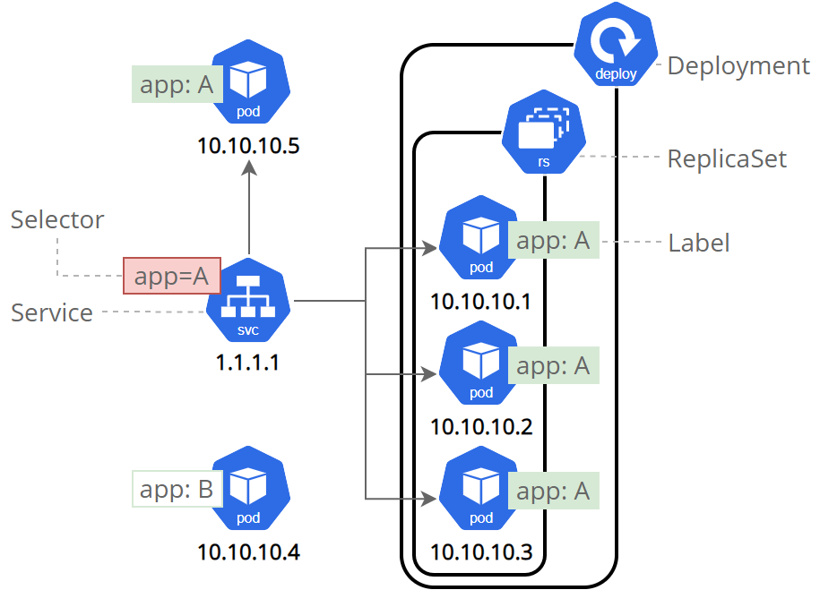

Na imagem:

- Vemos um Deployment que gerencia vários Pods da aplicação "A".
- Esses Pods estão sob um ReplicaSet, que garante que eles continuem rodando corretamente.
- O Service (svc) age como um ponto de entrada, encaminhando as solicitações para qualquer Pod da aplicação "A".
- A label app=A é usada para identificar quais Pods pertencem a essa aplicação.

&nbsp;

**Deployment do Backend no Kubernetes**

Crie um Repositório ECR para o Backend e suba a imagem Docker para o mesmo (Seguir os passos de criação, no gerenciador do ECR no site da AWS).

**Crie um arquivo de deployment do Kubernetes (YAML) para o Backend**

`cd challenge-day2/backend`  
`vim cloudmart-backend.yaml`

&nbsp;

```YAML
apiVersion: apps/v1
kind: Deployment
metadata:
  name: cloudmart-backend-app
spec:
  replicas: 1
  selector:
    matchLabels:
      app: cloudmart-backend-app
  template:
    metadata:
      labels:
        app: cloudmart-backend-app
    spec:
      serviceAccountName: cloudmart-pod-execution-role
      containers:
      - name: cloudmart-backend-app
        image: public.ecr.aws/l4c0j8h9/cloudmart-backend:latest
        env:
        - name: PORT
          value: "5000"
        - name: AWS_REGION
          value: "us-east-1"
        - name: BEDROCK_AGENT_ID
          value: "xxxxxx"
        - name: BEDROCK_AGENT_ALIAS_ID
          value: "xxxx"
        - name: OPENAI_API_KEY
          value: "xxxxxx"
        - name: OPENAI_ASSISTANT_ID
          value: "xxxx"
---

apiVersion: v1
kind: Service
metadata:
  name: cloudmart-backend-app-service
spec:
  type: LoadBalancer
  selector:
    app: cloudmart-backend-app
  ports:
    - protocol: TCP
      port: 5000
      targetPort: 5000
```

&nbsp;

**Realize o deployment do Backend no Kubernetes**  
`kubectl apply -f cloudmart-backend.yaml`

Acompanhe o status dos objetos sendo criados e obtenha o IP público gerado para a API  
`kubectl get pods`  
`kubectl get deployment`  
`kubectl get service`

&nbsp;

**Deployment do Frontend no Kubernetes**

**1 - Preparação**  
Altere o arquivo .env do Frontend para apontar para a URL da API criada dentro do Kubernetes obtida pela comando kubectl get service  
`cd ../challenge-day2/frontend`  
`nano .env`

**2 - Conteúdo do .env:**  
`VITE_API_BASE_URL=http://<sua_url_kubernetes_api>:5000/api`

**3 - Crie um Repositório ECR para o Frontend e suba a imagem Docker para o mesmo**  
&lt;Siga os passos do ECR&gt;

**4 - Crie um arquivo de deployment do Kubernetes (YAML) para o Frontend**  
`cd challenge-day2/frontend`  
`nano cloudmart-frontend.yaml`

```YAML
apiVersion: apps/v1
kind: Deployment
metadata:
  name: cloudmart-frontend-app
spec:
  replicas: 1
  selector:
    matchLabels:
      app: cloudmart-frontend-app
  template:
    metadata:
      labels:
        app: cloudmart-frontend-app
    spec:
      serviceAccountName: cloudmart-pod-execution-role
      containers:
      - name: cloudmart-frontend-app
        image: public.ecr.aws/l4c0j8h9/cloudmart-frontend:latest
---

apiVersion: v1
kind: Service
metadata:
  name: cloudmart-frontend-app-service
spec:
  type: LoadBalancer
  selector:
    app: cloudmart-frontend-app
  ports:
    - protocol: TCP
      port: 5001
      targetPort: 5001
```

&nbsp;

**Realize o deployment do Frontend no Kubernetes**  
`kubectl apply -f cloudmart-frontend.yaml`  
​  
**Acompanhe o status dos objetos sendo criados e obtenha o IP público gerado para a API**  
`kubectl get pods`  
`kubectl get deployment`  
`kubectl get service`

&nbsp;

**📝 Resumo do que fizemos até agora:**

- Criamos o arquivo de Docker (dockerfile) com as configurações
- Fizemos o build da imagem com o Docker
- Fizemos a criação do ECR e push para enviar a imagem da aplicação para o repositório remoto na AWS
- No Kubernetes criamos o arquivo de deployment e rodamos o `kubectl apply` para provisionar o backend e frontend.

Esses são os passos que teríamos que fazer **manualmente** para provisionar a aplicação, caso alguém solicitasse uma mudança no app.

==Agora, vamos implementar o **pipeline CI/CD** para que a aplicação seja atualizada no **piloto automático** sempre que houver uma mudança no código.==

Para o nosso exercício, vamos criar uma pipeline para o frontend com duas etapas:

&nbsp;- Na primeira etapa, vamos fazer o processo de build da imagem do docker que pegará no github as atualizações e criará uma imagem nova  
 - Na segunda etapa, a imagem será provisionada automaticamente dentro do cluster de kubernetes através do **codebuild**.

O **ECR** só está armazenando as imagens do **Docker** e o **Kubernetes** está provisionando containers, que entregarão o backend e frontend da aplicação.

&nbsp;

Para conectarmos o nosso Github com a EC2, vamos precisar fazer o passo a passo para clonar o repositório para a máquina virtual.

`echo "# bootcamp-tcb-multicloud-devops-ai-challenge" >> README.md`  
`git init`  
`git add README.md`  
`git commit -m "first commit"`  
`git branch -M main`  
`git remote add origin git@github.com:0isouza/bootcamp-tcb-multicloud-devops-ai-challenge.git`  
`git push -u origin main`

**⚠️ Remoção**  
**Ao final do hands-on, delete todos os recursos para evitar cobranças indesejadas:**  
`kubectl delete service cloudmart-frontend-app-service`  
`kubectl delete deployment cloudmart-frontend-app`  
`kubectl delete service cloudmart-backend-app-service`  
`kubectl delete deployment cloudmart-backend-app`

`eksctl delete cluster --name cloudmart --region us-east-1`

&nbsp;

# Dia 04 Criando agentes de IA com OpenAI e Amazon Bedrock

&nbsp;

> 💡 Reserve tempo para **estudar**. Se você deixar sua carreira em segundo plano, o mercado de trabalho também te deixará em **segundo plano**.

&nbsp;

Jensen Huang, CEO da NVIDIA, fez uma previsão audaciosa na CES 2025. Essa visão futurista reflete uma transformação já em curso, impulsionada pelos avanços em inteligência artificial.

**O departamento de TI de cada empresa será o departamento de RH de agentes de IA no futuro. Eles não apenas mantêm sistemas, mas cuidam de agentes digitais que realizam tarefas críticas para os negócios.**

*The IT department of every company is going to be the HR department of AI agents in the future. Today (IT Departments) manage and maintain a bunch of software from the IT industry. In the future they will maintain, nurture and onboard and improve a whole bunch of digital agents and provision them to the companies to use. Your IT department is going to become kind of like AI-agent HR.*

&nbsp;

**Inteligência Artificial e sua importância**

Hierarquia da Inteligência Artificial:

Artificial Inteligence (AI)  
       - Narrow AI  
                - Machne Learning (ML)  
                        - Deep Learning  
                                - Generative AI (GenAI)  
                                        - Large Language Models (LLM)  
                                                - Tools: *ChatGPT, Copilot, Gemini, etc*.

Foundations Models são frequentemente referidos como sinônimos de LLMs, devido às suas capacidades amplas adaptáveis.

&nbsp;

**AULA PRÁTICA**

Vamos criar 2 assistentes de IA. Um será um **assistente de compras pessoais** e outro será um **assistente de suporte**.

**Criação de recursos usando o Terraform**  
Navegue para a pasta que contém o arquivo main.tf e baixe o arquivo zip contendo a função Lambda que será usada pelo Bedrock  
`cd challenge-day2/backend/src/lambda`  
`cp list_products.zip terraform-project/`  
`cd terraform-project`  
<br/>

Adicione as linhas abaixo no final do arquivo `main.tf`

```Terraform
# IAM Role for Lambda function
resource "aws_iam_role" "lambda_role" {
  name = "cloudmart_lambda_role"

  assume_role_policy = jsonencode({
    Version = "2012-10-17"
    Statement = [
      {
        Action = "sts:AssumeRole"
        Effect = "Allow"
        Principal = {
          Service = "lambda.amazonaws.com"
        }
      }
    ]
  })
}

# IAM Policy for Lambda function
resource "aws_iam_role_policy" "lambda_policy" {
  name = "cloudmart_lambda_policy"
  role = aws_iam_role.lambda_role.id

  policy = jsonencode({
    Version = "2012-10-17"
    Statement = [
      {
        Effect = "Allow"
        Action = [
          "dynamodb:Scan",
          "logs:CreateLogGroup",
          "logs:CreateLogStream",
          "logs:PutLogEvents"
        ]
        Resource = [
          aws_dynamodb_table.cloudmart_products.arn,
          aws_dynamodb_table.cloudmart_orders.arn,
          aws_dynamodb_table.cloudmart_tickets.arn,
          "arn:aws:logs:*:*:*"
        ]
      }
    ]
  })
}

# Lambda function for listing products
resource "aws_lambda_function" "list_products" {
  filename         = "list_products.zip"
  function_name    = "cloudmart-list-products"
  role             = aws_iam_role.lambda_role.arn
  handler          = "index.handler"
  runtime          = "nodejs20.x"
  source_code_hash = filebase64sha256("list_products.zip")

  environment {
    variables = {
      PRODUCTS_TABLE = aws_dynamodb_table.cloudmart_products.name
    }
  }
}

# Lambda permission for Bedrock
resource "aws_lambda_permission" "allow_bedrock" {
  statement_id  = "AllowBedrockInvoke"
  action        = "lambda:InvokeFunction"
  function_name = aws_lambda_function.list_products.function_name
  principal     = "bedrock.amazonaws.com"
}

# Output the ARN of the Lambda function
output "list_products_function_arn" {
  value = aws_lambda_function.list_products.arn
}
```

&nbsp;

**Configuração do Agente Amazon Bedrock**  
<br/> - Solicitar acesso ao Cloud 3.0 Sonnet no Amazon Bedrock  
<br/>**Criar o Agente:**  
1 - No console Amazon Bedrock, escolha "Agents" em "Builder tools" no painel de navegação.  
2 - Clique em "Create agent".  
3 - Nomeie o agente "cloudmart-product-recommendation-agent".  
4 - Selecione "Claude 3 Sonnet" como o modelo base.  
5 - Cole as instruções do agente abaixo na seção "Instructions for the Agent".

```Plain
You are a product recommendations agent for CloudMart, an online e-commerce store. Your role is to assist customers in finding products that best suit their needs. Follow these instructions carefully:

1. Begin each interaction by retrieving the full list of products from the API. This will inform you of the available products and their details.

2. Your goal is to help users find suitable products based on their requirements. Ask questions to understand their needs and preferences if they're not clear from the user's initial input.

3. Use the 'name' parameter to filter products when appropriate. Do not use or mention any other filter parameters that are not part of the API.

4. Always base your product suggestions solely on the information returned by the API. Never recommend or mention products that are not in the API response.

5. When suggesting products, provide the name, description, and price as returned by the API. Do not invent or modify any product details.

6. If the user's request doesn't match any available products, politely inform them that we don't currently have such products and offer alternatives from the available list.

7. Be conversational and friendly, but focus on helping the user find suitable products efficiently.

8. Do not mention the API, database, or any technical aspects of how you retrieve the information. Present yourself as a knowledgeable sales assistant.

9. If you're unsure about a product's availability or details, always check with the API rather than making assumptions.

10. If the user asks about product features or comparisons, use only the information provided in the product descriptions from the API.

11. Be prepared to assist with a wide range of product inquiries, as our e-commerce store may carry various types of items.

12. If a user is looking for a specific type of product, use the 'name' parameter to search for relevant items, but be aware that this may not capture all categories or types of products.

Remember, your primary goal is to help users find the best products for their needs from what's available in our store. Be helpful, informative, and always base your recommendations on the actual product data provided by the API.
```

&nbsp;  
**Configurar a Função IAM:**  
1 - Na visão geral do Agente Bedrock, localize a seção 'Permissions'.  
2 - Clique no link da função IAM. Isso o levará ao console IAM com a função correta selecionada.  
3 - No console IAM, escolha "Add permissions" e depois "Create inline policy".  
4 - Na aba JSON, cole a seguinte política:

```JSON
{
  "Version": "2012-10-17",
  "Statement": [
    {
      "Effect": "Allow",
      "Action": "lambda:InvokeFunction",
      "Resource": "arn:aws:lambda:*:*:function:cloudmart-list-products"
    },
    {
      "Effect": "Allow",
      "Action": "bedrock:InvokeModel",
      "Resource": "arn:aws:bedrock:*::foundation-model/anthropic.claude-3-sonnet-20240229-v1:0"
    }
  ]
}
```

1 - Substitua cloudmart-list-products pelo nome real da sua função Lambda, se for diferente.  
2 - Nomeie a política (por exemplo, "BedrockAgentLambdaAccess") e crie-a.  
3 - Verifique se a nova política está anexada à função.

&nbsp;

**Configurar o Action Group:**  
1 - Na seção "Action groups", crie um novo grupo chamado "Get-Product-Recommendations".  
2 - Defina o tipo de grupo de ação como "Define with API schemas".  
3 - Selecione a função Lambda "cloudmart-list-products" como executor do grupo de ação.  
4 - Na seção "Action group schema", escolha "Define via in-line schema editor".  
5 - Cole o esquema OpenAPI abaixo no editor de esquema:

```OpenAPI
{
    "openapi": "3.0.0",
    "info": {
        "title": "Product Details API",
        "version": "1.0.0",
        "description": "This API retrieves product information. Filtering parameters are passed as query strings. If query strings are empty, it performs a full scan and retrieves the full product list."
    },
    "paths": {
        "/products": {
            "get": {
                "summary": "Retrieve product details",
                "description": "Retrieves a list of products based on the provided query string parameters. If no parameters are provided, it returns the full list of products.",
                "parameters": [
                    {
                        "name": "name",
                        "in": "query",
                        "description": "Retrieve details for a specific product by name",
                        "schema": {
                            "type": "string"
                        }
                    }
                ],
                "responses": {
                    "200": {
                        "description": "Successful response",
                        "content": {
                            "application/json": {
                                "schema": {
                                    "type": "array",
                                    "items": {
                                        "type": "object",
                                        "properties": {
                                            "name": {
                                                "type": "string"
                                            },
                                            "description": {
                                                "type": "string"
                                            },
                                            "price": {
                                                "type": "number"
                                            }
                                        }
                                    }
                                }
                            }
                        }
                    },
                    "500": {
                        "description": "Internal Server Error",
                        "content": {
                            "application/json": {
                                "schema": {
                                    "$ref": "#/components/schemas/ErrorResponse"
                                }
                            }
                        }
                    }
                }
            }
        }
    },
    "components": {
        "schemas": {
            "ErrorResponse": {
                "type": "object",
                "properties": {
                    "error": {
                        "type": "string",
                        "description": "Error message"
                    }
                },
                "required": [
                    "error"
                ]
            }
        }
    }
}
```

&nbsp;

**Configuração do Assistente OpenAI**

**Acesso ao OpenAI**

Acesse a plataforma OpenAI (https://platform.openai.com/).  
Faça login ou crie uma conta se ainda não tiver uma.

**Criar o Assistente**  
1 - Navegue até a seção "Assistants".  
2 - Clique em "Create New Assistant".  
3 - Nomeie o assistente "CloudMart Customer Support".  
4 - Selecione o modelo gpt-4o.

**Configurar o Assistente:**  
Na seção "Instructions", cole o seguinte:

*Você é um agente de suporte ao cliente para CloudMart, uma plataforma de e-commerce. Seu papel é auxiliar os clientes com consultas gerais, problemas de pedidos e fornecer informações úteis sobre o uso da plataforma CloudMart. Você não tem acesso direto a informações específicas de produtos ou inventário. Seja sempre educado, paciente e foque em fornecer um excelente atendimento ao cliente. Se um cliente perguntar sobre produtos específicos ou inventário, explique educadamente que você não tem acesso a essas informações e sugira que eles verifiquem o site ou falem com um representante de vendas.*  
​  
Em "Capabilities", você pode habilitar "Code Interpreter" se quiser que o assistente ajude com aspectos técnicos do uso da plataforma.

**Salvar o Assistente:**  
1 - Clique em "Save" para criar o assistente.  
2 - Anote o ID do Assistente, você precisará dele para suas variáveis de ambiente.

**Gerar Chave de API:**  
1 - Vá para a seção API Keys em sua conta OpenAI.  
2 - Gere uma nova chave de API.  
3 - Copie esta chave, você precisará dela para suas variáveis de ambiente.

==As assistentes de IA atuais podem chamar **funções via API** que tomam ações que **atendentes humanos** tomariam, como cancelar pedidos, alterar dados de contas, realizar pagamentos ou fornecer suporte técnico, otimizando processos e melhorando a eficiência no atendimento ao cliente.==

&nbsp;

**Faça o redeployment do backend com os AI Assistants**

Atualize o arquivo cloudmart-backend.yaml com as informações dos AI Assistants:  
Abra o arquivo cloudmart-backend.yaml.  
`nano cloudmart-backend.yaml`

Conteúdo do cloudmart-backend.yaml:

```YAML
apiVersion: apps/v1
kind: Deployment
metadata:
  name: cloudmart-backend-app
spec:
  replicas: 1
  selector:
    matchLabels:
      app: cloudmart-backend-app
  template:
    metadata:
      labels:
        app: cloudmart-backend-app
    spec:
      serviceAccountName: cloudmart-pod-execution-role
      containers:
      - name: cloudmart-backend-app
        image: public.ecr.aws/l4c0j8h9/cloudmaster-backend:latest
        env:
        - name: PORT
          value: "5000"
        - name: AWS_REGION
          value: "us-east-1"
        - name: BEDROCK_AGENT_ID
          value: "xxxx"
        - name: BEDROCK_AGENT_ALIAS_ID
          value: "xxxx"
        - name: OPENAI_API_KEY
          value: "xxxx"
        - name: OPENAI_ASSISTANT_ID
          value: "xxxx"
---

apiVersion: v1
kind: Service
metadata:
  name: cloudmart-backend-app-service
spec:
  type: LoadBalancer
  selector:
    app: cloudmart-backend-app
  ports:
    - protocol: TCP
      port: 5000
      targetPort: 5000
```

&nbsp;

**Atualize o deployment no Kubernetes**  
`kubectl apply -f cloudmart-backend.yaml`

&nbsp;

**Teste o AI Assistant**\*\*:\*\*

**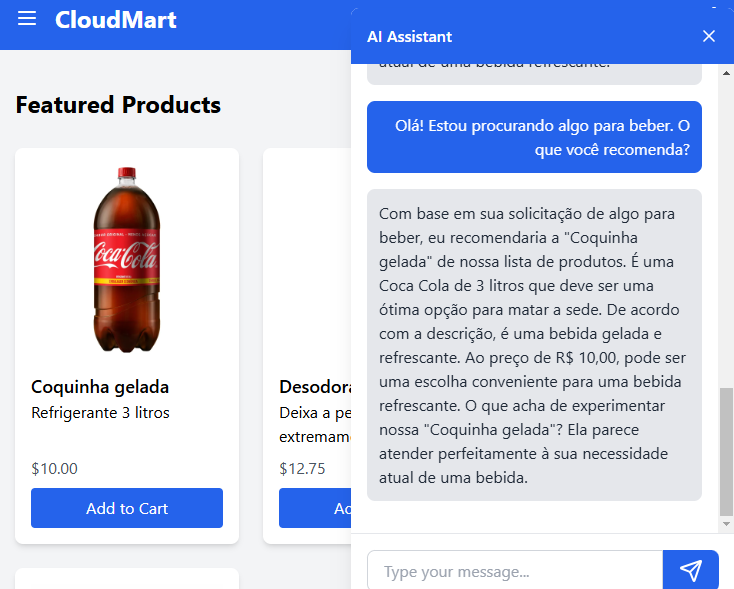**

&nbsp;

&nbsp;

# Dia 05 - Indo para MultiCloud: DW/BI no Google Cloud & Análise de Sentimentos com Microsoft Azure AI

&nbsp;

> 💡 Profissionais de TI não serão substituídos pela IA, mas sim por alguém que **SABE usar** IA.

&nbsp;

**A evolução das posições**

Engenheiro de infraestrutura on-premisses -> **Engenheiro de Cloud Infra**

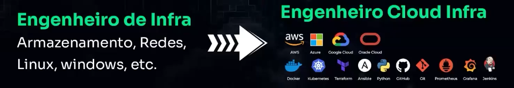

Engengeiro de Suporte -> **Engenheiro de Suporte Cloud**

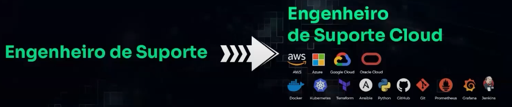  
<br/>

Engenheiro de Segurança -> **Engenheiro de Segurança Cloud**

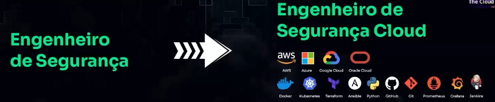

Administrador de Sistemas -> **Administrador de Sistemas Cloud**

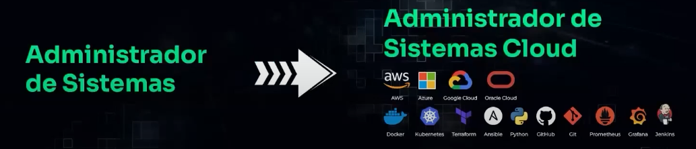

Gerente de TI -> **Gerente de TI especializado em Cloud e DevOps**

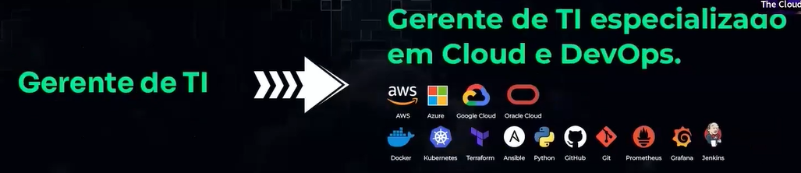

Desenvolvedor -> **Desenvolvedor Cloud**

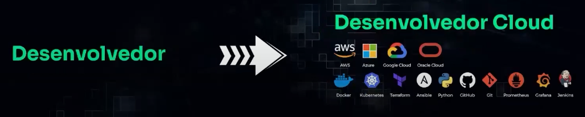

Engenheiro Clooud Infra, DBA especializado em Cloud, Desenvolvedor Cloud >  
**Arquiteto Cloud, Engenheiro Cloud, Site Reliability Engineering (SRE)**

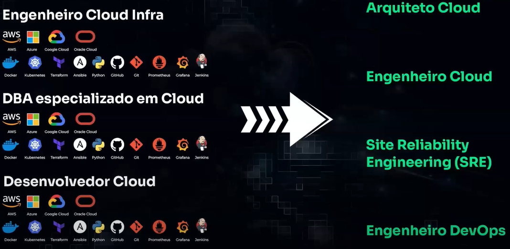

**AULA PRÁTICA**

**Configure a função lambda:**

**Instale as dependências requiridas:**  
`cd src/lambda/addToBigQuery`  
`sudo yum install npm`  
`npm install`  
**Edite** o arquivo `google_credentials.json` e cole o conteúdo com a sua chave.  
**Crie** o arquivo zip do diretório completo:  
`zip -r dynamodb_to_bigquery.zip .`  
Retorne ao diretório raiz do projeto:  
`cd ..`

&nbsp;

**Configuração do Terraform**  
Apague o arquivo main.tf e crie um novo:  
`rm main.tf`  
`nano main.tf`  
​  
Adicione essas linhas no arquivo, substituindo o `GOOGLE_CLOUD_PROJECT_ID` pelo **nome do projeto** da **GCP**.

```Terraform
provider "aws" {  
  region = "us-east-1" # Altere para sua região preferida  
}

# Tabelas DynamoDB  
resource "aws_dynamodb_table" "cloudmart_products" {  
  name = "cloudmart-products"  
  billing_mode = "PAY_PER_REQUEST"  
  hash_key = "id"

&nbsp; attribute {  
    name = "id"  
    type = "S"  
  }  
}

resource "aws_dynamodb_table" "cloudmart_orders" {  
  name = "cloudmart-orders"  
  billing_mode = "PAY_PER_REQUEST"  
  hash_key = "id"

&nbsp; attribute {  
    name = "id"  
    type = "S"  
  }

&nbsp; stream_enabled = true  
  stream_view_type = "NEW_AND_OLD_IMAGES"  
}

resource "aws_dynamodb_table" "cloudmart_tickets" {  
  name = "cloudmart-tickets"  
  billing_mode = "PAY_PER_REQUEST"  
  hash_key = "id"

&nbsp; attribute {  
    name = "id"  
    type = "S"  
  }  
}

# IAM Role for Lambda function  
resource "aws_iam_role" "lambda_role" {  
  name = "cloudmart_lambda_role"

&nbsp; assume_role_policy = jsonencode({  
    Version = "2012-10-17"  
    Statement = [  
      {  
        Action = "sts:AssumeRole"  
        Effect = "Allow"  
        Principal = {  
          Service = "lambda.amazonaws.com"  
        }  
      }  
    ]  
  })  
}

# IAM Policy for Lambda function  
resource "aws_iam_role_policy" "lambda_policy" {  
  name = "cloudmart_lambda_policy"  
  role = aws_iam_role.lambda_role.id

&nbsp; policy = jsonencode({  
    Version = "2012-10-17"  
    Statement = [  
      {  
        Effect = "Allow"  
        Action = [  
          "dynamodb:Scan",  
          "dynamodb:GetRecords",  
          "dynamodb:GetShardIterator",  
          "dynamodb:DescribeStream",  
          "dynamodb:ListStreams",  
          "logs:CreateLogGroup",  
          "logs:CreateLogStream",  
          "logs:PutLogEvents"  
        ]  
        Resource = [  
          aws_dynamodb_table.cloudmart_products.arn,  
          aws_dynamodb_table.cloudmart_orders.arn,  
          "${aws_dynamodb_table.cloudmart_orders.arn}/stream/*",  
          aws_dynamodb_table.cloudmart_tickets.arn,  
          "arn:aws:logs:*:*:*"  
        ]  
      }  
    ]  
  })  
}

# Lambda function for listing products  
resource "aws_lambda_function" "list_products" {  
  filename = "list_products.zip"  
  function_name = "cloudmart-list-products"  
  role = aws_iam_role.lambda_role.arn  
  handler = "index.handler"  
  runtime = "nodejs20.x"  
  source_code_hash = filebase64sha256("list_products.zip")

&nbsp; environment {  
    variables = {  
      PRODUCTS_TABLE = aws_dynamodb_table.cloudmart_products.name  
    }  
  }  
}

# Lambda permission for Bedrock  
resource "aws_lambda_permission" "allow_bedrock" {  
  statement_id = "AllowBedrockInvoke"  
  action = "lambda:InvokeFunction"  
  function_name = aws_lambda_function.list_products.function_name  
  principal = "bedrock.amazonaws.com"  
}

# Output the ARN of the Lambda function  
output "list_products_function_arn" {  
  value = aws_lambda_function.list_products.arn  
}

# Lambda function for DynamoDB to BigQuery  
resource "aws_lambda_function" "dynamodb_to_bigquery" {  
  filename = "../challenge-day2/backend/src/lambda/addToBigQuery/dynamodb_to_bigquery.zip"  
  function_name = "cloudmart-dynamodb-to-bigquery"  
  role = aws_iam_role.lambda_role.arn  
  handler = "index.handler"  
  runtime = "nodejs20.x"  
  source_code_hash = filebase64sha256("../challenge-day2/backend/src/lambda/addToBigQuery/dynamodb_to_bigquery.zip")

&nbsp; environment {  
    variables = {  
      GOOGLE_CLOUD_PROJECT_ID = "lustrous-bounty-436219-f1"  
      BIGQUERY_DATASET_ID = "cloudmart"  
      BIGQUERY_TABLE_ID = "cloudmart-orders"  
      GOOGLE_APPLICATION_CREDENTIALS = "/var/task/google_credentials.json"  
    }  
  }  
}

# Lambda event source mapping for DynamoDB stream  
resource "aws_lambda_event_source_mapping" "dynamodb_stream" {  
  event_source_arn = aws_dynamodb_table.cloudmart_orders.stream_arn  
  function_name = aws_lambda_function.dynamodb_to_bigquery.arn  
  starting_position = "LATEST"  
}
```

​  
Agora, execute `terraform apply` .

&nbsp;

**Verificar se o stream foi ativado, no DynamoDB:**

DynamoDB > Tabelas > cloudmart-orders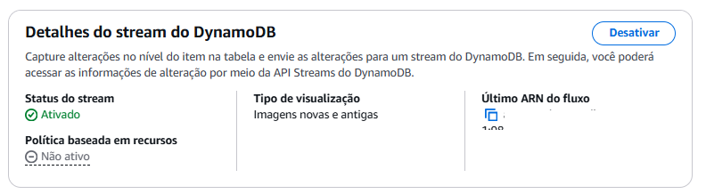

**Azure Text Analytics Setup**

Siga estas etapas para configurar o Azure Text Analytics para análise de sentimento:

**1 - Crie uma conta do Azure:**

- Acesse o portal do Azure (https://portal.azure.com/).
- Faça login ou crie uma nova conta se ainda não tiver uma.

**2 - Crie um recurso:**

- No portal do Azure, clique em “Criar um recurso”.
- Procure por "Text Analytics" e selecione-o.
- Clique em "Criar".

**3 - Configure o recurso:**

- Escolha sua assinatura e grupo de recursos (crie um novo, se necessário).
- Nomeie o recurso (por exemplo, "cloudmart-text-analytics").
- Escolha sua região e nível de preços.
- Clique em “Revisar + criar” e depois em “Criar”.

**4 - Obtenha o endpoint e a chave:**

- Depois que o recurso for criado, vá para sua página de visão geral.
- No menu esquerdo, em “Gerenciamento de Recursos”, clique em “Chaves e Endpoint”.
- Copie o URL do endpoint e uma das chaves.

&nbsp;

**Deploy das mudanças para o Backend**

Abra o arquivo cloudmart-backend.yaml:`nano cloudmart-backend.yaml`

&nbsp;

```YAML
apiVersion: apps/v1
kind: Deployment
metadata:
  name: cloudmart-backend-app
spec:
  replicas: 1
  selector:
    matchLabels:
      app: cloudmart-backend-app
  template:
    metadata:
      labels:
        app: cloudmart-backend-app
    spec:
      serviceAccountName: cloudmart-pod-execution-role
      containers:
      - name: cloudmart-backend-app
        image: public.ecr.aws/l4c0j8h9/cloudmaster-backend:latest
        env:
        - name: PORT
          value: "5000"
        - name: AWS_REGION
          value: "us-east-1"
        - name: BEDROCK_AGENT_ID
          value: "xxxx"
        - name: BEDROCK_AGENT_ALIAS_ID
          value: "xxxx"
        - name: OPENAI_API_KEY
          value: "xxxx"
        - name: OPENAI_ASSISTANT_ID
          value: "xxxx"
        - name: AZURE_ENDPOINT
          value: "xxxx"
        - name: AZURE_API_KEY
          value: "xxxx"
        
---

apiVersion: v1
kind: Service
metadata:
  name: cloudmart-backend-app-service
spec:
  type: LoadBalancer
  selector:
    app: cloudmart-backend-app
  ports:
    - protocol: TCP
      port: 5000
      targetPort: 5000
```

&nbsp;

**Faça o build de uma nova imagem no ECR**

`Seguir os passos de push no ECR`

📝 O Docker tem uma inteligência de camadas que identifica em quais camadas (layers) que houveram alterações de código, para agilizar o processo de push.

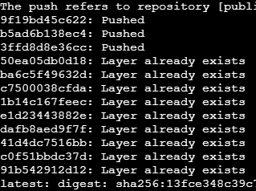

&nbsp;

**Atualize o deployment no Kubernetes**

`kubectl apply -f cloudmart-backend.yaml`

==*O Kubernetes é considerado **zero downtime** pois durante o processo de atualização do código, ele cria um **novo pod** com as mudanças mais recentes e começa a direcionar as requisições para esse novo pod. Somente quando todas as requisições estão sendo atendidas pelo novo pod, o pod antigo é encerrado.*==

&nbsp;

# CONCLUSÃO

Nos últimos cinco dias, mergulhei de cabeça no mundo DevOps e MultiCloud, aprendendo e praticando tecnologias essenciais para automação, orquestração e integração de aplicações na nuvem.

No **Dia 1**, comecei automatizando o provisionamento de infraestrutura na AWS com **Terraform**, criando recursos como **EC2, S3 e IAM** de forma declarativa. Além disso, utilizei o **Claude AI** para auxiliar na otimização dos meus códigos.

No **Dia 2**, avancei para a containerização e orquestração, trabalhando com **Docker e Kubernetes** na AWS. Aprendi a criar imagens Docker para backend e frontend, configurando um **DynamoDB** como banco de dados. Também entendi como Kubernetes gerencia contêineres de forma eficiente, escalável e confiável.

No **Dia 3**, aprofundei meu conhecimento sobre **CI/CD**, implementando pipelines DevOps na AWS. Usei o **Elastic Container Registry (ECR)** para armazenar imagens Docker e implementei o **Elastic Kubernetes Service (EKS)** para orquestração automática. Foi um dia essencial para consolidar a ideia de automação total no ciclo de vida da aplicação.

No **Dia 4**, explorei a criação de **agentes de IA** com **Amazon Bedrock e OpenAI**. Desenvolvi um assistente de recomendações para e-commerce e um chatbot de suporte ao cliente, ambos integrados com APIs externas e modelos de IA generativa.

No **Dia 5**, expandi a aplicação para um ambiente **MultiCloud**, usando **Google Cloud** para processamento de dados com **BigQuery** e **Microsoft Azure AI** para análise de sentimentos. Implementei um fluxo de dados do **DynamoDB da AWS para o BigQuery da GCP**, automatizando a ingestão e análise de informações.

Foi uma experiência intensa e transformadora, onde pude consolidar conceitos fundamentais de DevOps, Cloud e IA, aplicando-os em um projeto real e totalmente integrado entre múltiplas plataformas. 🚀